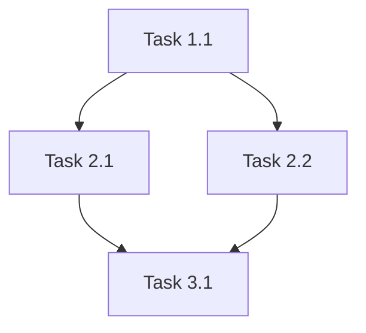

# /plan - 작업 계획 스킬

## What
복잡한 요구사항을 구체적이고 실행 가능한 단계로 분해하여 계획 수립

## When
- 모호한 요구사항을 받았을 때
- 3단계 이상의 복잡한 작업
- 의존성이 복잡한 작업
- 여러 파일/컴포넌트에 영향을 주는 작업
- 새로운 기능 구현 시작 전

## Workflow

### 1단계: 요구사항 구체화
AskUserQuestion을 사용한 구조화된 질문:

```markdown
## 🤔 요구사항 명확화

**기능 목적**:
- 이 기능은 누가 사용하나요?
- 해결하려는 문제는 무엇인가요?

**기술 제약**:
- 사용할 기술 스택이 정해져 있나요?
- 성능/보안 요구사항이 있나요?

**범위 정의**:
- MVP에 꼭 필요한 기능만 포함할까요?
- 제외할 기능이 있나요?
```

### 2단계: 작업 분해
요구사항을 계층적으로 분해:

**구조**:
```
📋 목표: [최종 목표]
  ├── 🎯 Phase 1: [준비 단계]
  │   ├── Task 1.1: [구체적 작업]
  │   └── Task 1.2: [구체적 작업]
  ├── 🎯 Phase 2: [핵심 구현]
  │   ├── Task 2.1: [구체적 작업]
  │   └── Task 2.2: [구체적 작업]
  └── 🎯 Phase 3: [검증 및 마무리]
      ├── Task 3.1: [구체적 작업]
      └── Task 3.2: [구체적 작업]
```

**각 Task 상세**:
- 설명: 무엇을 하는지
- 파일: 수정/생성할 파일
- 예상 시간: 복잡도 표시 (🟢 간단 / 🟡 보통 / 🔴 복잡)
- 의존성: 선행 작업
- 검증: 완료 기준

### 3단계: 의존성 매핑
작업 간 의존성 시각화:



**병렬 가능 작업 표시**:
```
⚡ 병렬 실행 가능:
- Task 2.1 & Task 2.2 (독립적)

⏳ 순차 실행 필요:
- Task 1.1 → Task 2.1 (의존성)
```

### 4단계: 리스크 및 고려사항
잠재적 문제점 사전 식별:

```markdown
## ⚠️ 주의사항

**기술 리스크**:
- [리스크 1]: [완화 방안]
- [리스크 2]: [완화 방안]

**Trade-offs**:
- 성능 vs 가독성: [선택 및 이유]
- 완성도 vs 속도: [MVP 범위]

**알려진 이슈**:
- [관련 버그/제한사항]
```

### 5단계: 계획 문서 생성
`.claude/plans/[timestamp]-[feature-name].md` 생성:

```markdown
# 계획: [기능명]

**작성일**: 2024-01-15
**예상 소요**: [Phase 개수 기준 추정]
**상태**: 🟡 진행 중

## 목표
[최종 목표 명확한 설명]

## 전제조건
- [ ] [필요한 환경/도구]
- [ ] [선행 작업]

## 작업 단계

### Phase 1: [준비]
- [ ] **Task 1.1**: [작업 설명]
  - 파일: `src/auth.py`
  - 복잡도: 🟢
  - 의존: 없음
  - 완료 기준: 유닛 테스트 통과

...

## 검증 계획
- [ ] 유닛 테스트 작성 및 통과
- [ ] 통합 테스트 실행
- [ ] 성능 벤치마크 (목표: < 100ms)
- [ ] 보안 리뷰

## 롤백 계획
[문제 발생 시 되돌리는 방법]

## 참고 자료
- [관련 문서/이슈 링크]
```

### 6단계: TodoWrite 연동
계획의 각 Task를 TodoWrite로 생성:

```python
# 자동 생성 예시
TodoWrite([
    {"subject": "Task 1.1: DB 스키마 설계", "description": "..."},
    {"subject": "Task 1.2: 마이그레이션 파일 생성", "description": "..."},
    ...
])
```

## Output Example
```markdown
# 📋 작업 계획: JWT 인증 시스템 구현

## 요구사항 정리
**목적**: 사용자 인증 및 권한 관리
**사용자**: 웹/모바일 앱 사용자
**MVP 범위**: 로그인, 토큰 발급, 토큰 검증

## 작업 분해

### 🎯 Phase 1: 준비 (30분)
- [ ] **Task 1.1**: DB 스키마 설계
  - 파일: `migrations/001_users.sql`
  - 복잡도: 🟢
  - 완료: 스키마 리뷰 완료

- [ ] **Task 1.2**: 환경 변수 설정
  - 파일: `.env.example`
  - 복잡도: 🟢
  - 완료: JWT_SECRET 설정됨

### 🎯 Phase 2: 핵심 구현 (2시간)
- [ ] **Task 2.1**: JWT 토큰 생성 함수
  - 파일: `src/auth/jwt.py`
  - 복잡도: 🟡
  - 의존: Task 1.2
  - 완료: 유닛 테스트 통과

- [ ] **Task 2.2**: 인증 미들웨어
  - 파일: `src/auth/middleware.py`
  - 복잡도: 🟡
  - 의존: Task 2.1
  - 완료: 통합 테스트 통과

### 🎯 Phase 3: 검증 (1시간)
- [ ] **Task 3.1**: E2E 테스트
  - 파일: `tests/test_auth_flow.py`
  - 복잡도: 🟡
  - 의존: Phase 2 완료
  - 완료: 전체 플로우 성공

⚡ **병렬 가능**: Task 1.1 & Task 1.2

## ⚠️ 주의사항
- JWT_SECRET은 절대 Git에 커밋 금지
- 토큰 만료 시간: 15분 (리프레시 토큰은 7일)
- HTTPS 환경에서만 사용 (쿠키 Secure 플래그)

## 검증 계획
- /verify로 린트/타입/테스트 검증
- Postman으로 API 수동 테스트
- 보안 리뷰: OWASP Top 10 체크리스트

---
✅ 계획서가 `.claude/plans/2024-01-15-jwt-auth.md`에 저장되었습니다.
💡 `/task` 또는 바로 구현을 시작하세요.
```

## Edge Cases
1. **요구사항 모호**: 추가 질문 (최대 3회)
2. **너무 큰 범위**: Phase 분할 제안
3. **의존성 순환**: 경고 및 재설계 요청
4. **MVP 불명확**: 최소 기능 제안

## Integration
- `/wrap`에서 미완성 계획 추적
- `/verify`로 각 Phase 완료 확인
- `/commit`으로 Phase별 커밋
- TodoWrite로 작업 추적

## Best Practices
- Phase는 3-5개로 제한
- 각 Task는 1-2시간 내 완료 가능 크기
- 의존성은 명확히 표시
- 완료 기준은 측정 가능하게
